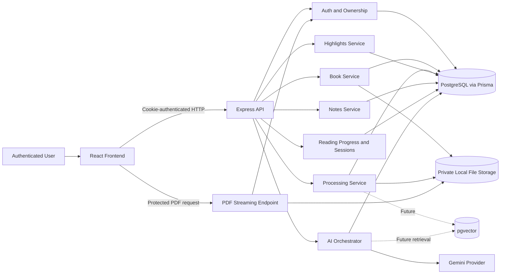
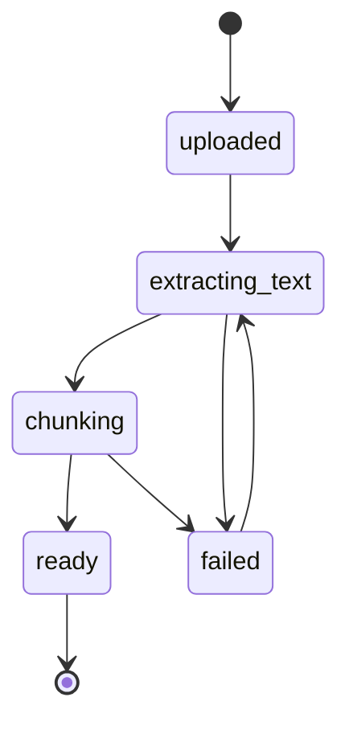

# Sophia — Project Source of Truth

> **Tagline:** A place beyond the noise.  
> **Product:** AI-assisted philosophy reading companion  
> **Status:** Active MVP development  
> **Current phase:** Sprint 6 — Notes, Highlights, and Reading Sessions  
> **Current task:** S6-T3 — Notes System

---

## 1. Purpose of This Document

This file is the main product and engineering reference for Sophia.

It should help a developer or coding agent understand:

- what Sophia is;
- what makes it different;
- what has already been built;
- the current architecture;
- the current product decisions;
- the security and ownership rules;
- the MVP roadmap;
- the active task;
- what must not be implemented yet.

Update this document whenever a major product, architecture, or roadmap decision changes.

The repository and database schema remain the final authority for implementation details. When this document and the code disagree, audit the code, identify the mismatch, and update the documentation rather than guessing.

---

## 2. Product Vision

Sophia is an AI-powered philosophy reading companion.

It is not intended to become:

- a generic chatbot;
- a generic PDF viewer;
- a generic note-taking application;
- an AI wrapper around a book.

Sophia should become the best environment for reading, understanding, reflecting on, and retaining philosophical ideas.

The product is built around one belief:

> Reading philosophy is not about finishing books. It is about understanding ideas, questioning assumptions, and gradually building your own philosophy.

Sophia should feel like:

- a quiet study room;
- a thoughtful companion;
- a mentor;
- a private intellectual workspace;
- a long-term record of the reader’s philosophical journey.

AI is one part of the experience, not the entire product.

---

## 3. The Problem

Reading philosophy is currently fragmented across disconnected tools:

- a PDF reader for reading;
- ChatGPT or another assistant for explanations;
- Notion or paper for notes;
- separate tools for highlights;
- memory for connecting ideas across books;
- music or ambient applications for focus.

This fragmentation causes:

- temporary understanding;
- lost notes and reflections;
- weak connections between books;
- repeated questions;
- context switching;
- shallow reading.

Sophia unifies the reading journey into one coherent experience.

---

## 4. Core Value Proposition

Sophia helps users:

- read philosophy comfortably;
- understand difficult passages;
- navigate books and chapters;
- highlight meaningful passages;
- save private notes and reflections;
- ask contextual questions;
- build long-term philosophical understanding;
- resume reading without losing their place;
- connect ideas across time.

The product is specialized for philosophy rather than every document category.

---

## 5. Initial Audience

The first audience is people who read philosophy and philosophical literature, including readers of:

- Plato;
- Aristotle;
- Marcus Aurelius;
- Seneca;
- Schopenhauer;
- Nietzsche;
- Dostoevsky;
- Camus;
- related authors and traditions.

The MVP is intentionally optimized for one primary user first: the developer.

> If Sophia genuinely improves one person’s philosophy reading, it can later be expanded for others.

---

## 6. Product Principles

### 6.1 Experience over feature count

Sophia does not win by having the longest feature list.

It wins by making the complete experience of reading philosophy feel coherent, calm, and meaningful.

### 6.2 AI should remain contextual

AI responses should be grounded in:

- the current passage;
- the current chapter;
- the book;
- the user’s approved memory;
- relevant philosophical context.

AI should not behave like an unrelated general chat window.

### 6.3 Preserve the source

The original PDF remains the authoritative visual source.

Sophia may extract text and structure for:

- chapter navigation;
- chunking;
- source citations;
- AI context;
- search;
- future semantic retrieval.

The extracted text should not replace the original PDF as the main reader unless that decision is explicitly revisited.

### 6.4 Prefer shipping over over-engineering

Every feature should answer:

> Does this improve the philosophy reading experience?

If not, it should not be part of the MVP.

### 6.5 Ownership and privacy are mandatory

Books, notes, highlights, progress, sessions, and memory are private user data.

Every related operation must be scoped to the authenticated user.

### 6.6 Fail clearly

The interface must never remain in an endless loading state.

Every asynchronous operation requires:

- loading;
- success;
- empty;
- recoverable error;
- cleanup.

---

## 7. MVP User Journey

```text
Register or log in
        ↓
Upload a text-based philosophy PDF
        ↓
Book appears in the personal library
        ↓
Prepare the book for reading
        ↓
Extract pages
        ↓
Detect chapters
        ↓
Generate chunks
        ↓
Book becomes ready
        ↓
Open the protected reader
        ↓
Read the original PDF
        ↓
Navigate chapters
        ↓
Choose a reading mood
        ↓
Resume saved progress
        ↓
Select and highlight passages
        ↓
Write private notes
        ↓
Later: ask Sophia contextual questions
```

---

## 8. Current Technology Stack

### Frontend

- React
- TypeScript
- Tailwind CSS or the repository’s current styling system
- Extend UI PDF Viewer
- shadcn-style source components where applicable
- React Router or the repository’s current routing solution

### Backend

- Node.js
- Express.js
- TypeScript
- Prisma ORM

### Database

- PostgreSQL

### Storage

- Local filesystem for uploaded PDFs and generated covers during the MVP
- Storage directories must remain private and outside public frontend assets

### AI

- Gemini API
- Provider abstraction and AI orchestrator
- No direct Gemini calls from controllers

### Future

- PostgreSQL `pgvector`
- embeddings
- semantic retrieval
- retrieval evaluation
- richer AI memory
- optional advanced PDF parsing or OCR after the MVP

---

## 9. High-Level Architecture



---

## 10. PDF Architecture

### 10.1 Main reader

The main reading surface uses the original PDF through Extend UI.

```text
Private PDF
    ↓
Protected ownership-aware endpoint
    ↓
Extend UI
    ↓
Original layout preserved
```

### 10.2 Backend extraction

Backend extraction remains required even though the original PDF is the main reader.

```text
PDF
  ↓
Page text extraction
  ↓
Chapter detection
  ↓
Chunk generation
  ↓
AI context, navigation, citations, and future retrieval
```

Do not delete extracted pages, chapters, or chunks merely because they are not used as the primary visual reader.

### 10.3 MVP PDF scope

Supported:

- normal digital PDFs;
- selectable embedded text;
- mostly text-based philosophy books.

Not currently supported:

- scanned image-only PDFs;
- DRM-protected PDFs;
- password-protected PDFs;
- OCR-dependent books;
- complex layout reconstruction guarantees.

### 10.4 Protected PDF access

The reader must never receive a raw filesystem path.

The PDF endpoint must:

- require authentication;
- use `req.auth.userId`;
- verify ownership through `user_books`;
- use `userBookId`, not a client-supplied filesystem path;
- serve `application/pdf`;
- return `404` for missing or unowned resources;
- preserve private storage;
- support byte ranges when the existing viewer requires them.

---

## 11. Reading Moods

The user-facing control is named **Reading Mood**.

The three planned moods are:

### Printed Ink

- soft off-white PDF page;
- deep Sophia ink text;
- clean printed-book appearance;
- restrained page shadow.

### Warm Paper

- warm parchment or ivory page;
- warm dark ink;
- Sophia gold accents;
- comfortable long-session contrast.

### Night Study

- deep navy PDF page;
- warm ivory text;
- darker surrounding reader surface;
- muted gold accents.

Important constraints:

- the original PDF file remains unchanged;
- the PDF layout remains unchanged;
- mood changes must not reset page, zoom, or progress;
- visual transformation should target the rendered PDF page layer;
- toolbars, highlights, notes, and selection overlays must not be accidentally filtered;
- colored images may also be transformed;
- the original/native appearance should remain recoverable if needed.

---

## 12. Authentication and Session Model

Authentication currently includes:

- email registration;
- email login;
- password hashing;
- short-lived access tokens;
- refresh-token rotation;
- persistent server-side sessions;
- logout;
- current-user endpoint;
- protected frontend routes.

Security decisions:

- use HTTP-only cookies;
- do not store authentication tokens in `localStorage`;
- use `credentials: "include"` for frontend requests;
- use the authenticated request context;
- never trust `userId` from the request body;
- revoke refresh tokens and sessions correctly;
- do not expose raw tokens in logs.

Expected request context:

```ts
req.auth = {
  userId: string
  sessionId: string
}
```

---

## 13. Core Ownership Rule

Most book operations are scoped through `user_books`.

For a route containing `:userBookId`, the backend should conceptually verify:

```ts
where: {
  id: userBookId,
  userId: req.auth.userId
}
```

If no matching owned record exists:

- return `404`;
- do not reveal whether another user owns it.

This rule applies to:

- reader initialization;
- PDF streaming;
- processing status;
- processing;
- progress;
- highlights;
- notes;
- reading sessions;
- chat sessions;
- future memory connected to a book.

Never authorize a book action using only `bookId`.

---

## 14. Processing Pipeline



Current status values:

- `uploaded`
- `extracting_text`
- `chunking`
- `ready`
- `failed`

Pipeline:

1. Verify ownership.
2. Read the trusted PDF path.
3. Extract text page by page.
4. Store page text and hashes.
5. Detect chapters heuristically.
6. Connect pages to chapters where possible.
7. Generate stable text chunks.
8. Store page ranges and chunk metadata.
9. Mark the book ready.
10. Store a clean public processing error when a step fails.

A book with no detected chapters can still become ready.

A scanned PDF with no extractable text should fail gracefully rather than trigger OCR during the MVP.

---

## 15. Core Domain Model

The actual Prisma schema is authoritative. This section documents the intended responsibility of the main entities.

### Identity and authentication

- `users`
- `auth_accounts`
- `sessions`
- `refresh_tokens`
- `user_preferences`
- `user_reading_profiles`

### Books and ownership

- `books` — source book metadata and private storage references
- `user_books` — user ownership and user-specific book state

### Processed reading structure

- `pages`
- `chapters`
- `book_chunks`

### Reader activity

- `reading_progress`
- `reading_sessions`

### Reflection

- `highlights`
- `notes`

### AI conversation

- `chat_sessions`
- `chat_messages`
- `chapter_summaries`

### Personalization

- `user_memory`

---

## 16. API Conventions

Use the repository’s actual route prefix. Do not guess whether it is `/books` or `/api/books`.

Conceptual route groups:

### Authentication

```text
POST /auth/register
POST /auth/login
POST /auth/refresh
POST /auth/logout
GET  /auth/me
```

### Library and books

```text
GET   /books
GET   /books/:userBookId
POST  /books/upload
PATCH /books/:userBookId/metadata
GET   /books/:userBookId/cover
```

### Processing

```text
POST /books/:userBookId/process
GET  /books/:userBookId/processing-status
```

### Reader

```text
GET /books/:userBookId/reader
GET /books/:userBookId/pdf
```

### Reading progress

```text
GET   /books/:userBookId/progress
PATCH /books/:userBookId/progress
```

### Highlights

```text
GET    /books/:userBookId/highlights
POST   /books/:userBookId/highlights
PATCH  /books/:userBookId/highlights/:highlightId
DELETE /books/:userBookId/highlights/:highlightId
```

### Notes

```text
GET    /books/:userBookId/notes
POST   /books/:userBookId/notes
GET    /books/:userBookId/notes/:noteId
PATCH  /books/:userBookId/notes/:noteId
DELETE /books/:userBookId/notes/:noteId
```

Before adding a route:

1. inspect the existing router;
2. inspect its mount path;
3. verify the final URL;
4. verify the frontend client;
5. verify `userBookId` versus `bookId`;
6. avoid creating a duplicate route with a different naming pattern.

---

## 17. Frontend Reader Responsibilities

The reader currently or eventually includes:

- protected route;
- reader initialization;
- original PDF rendering;
- chapter navigation;
- page status;
- reading preferences;
- reading mood;
- persistent progress;
- text selection;
- highlight preview;
- persistent highlights;
- private notes;
- reading sessions;
- later AI companion panel.

Reader components should not become one large file.

Suggested feature organization:

```text
frontend/src/features/reader/
├── components/
├── pdf/
├── chapters/
├── preferences/
├── progress/
├── selection/
├── highlights/
├── notes/
├── sessions/
├── api/
├── reader.types.ts
└── reader.utils.ts
```

Follow the repository’s existing structure rather than forcing this exact tree.

---

## 18. Highlight Behavior

Expected flow:

```text
Select text
    ↓
Selection toolbar appears
    ↓
Default highlight color is previewed immediately
    ↓
Changing color updates the live preview
    ↓
No database write occurs during preview
    ↓
User confirms
    ↓
One persistent highlight is created
```

Rules:

- preview state is frontend-only;
- saved highlights use controlled color names;
- arbitrary CSS colors are not accepted;
- clicking elsewhere removes an unsaved preview;
- no separate Cancel button is required;
- native copy must continue to work;
- failed save should preserve enough state to retry;
- do not use unsafe HTML;
- do not create inaccurate PDF overlays when coordinates are unavailable.

---

## 19. Notes System — Current Task

### Task

**S6-T3 — Notes System**

Suggested branch:

```text
feature/s6-notes
```

### Goal

Allow authenticated users to create, view, edit, and delete private notes while reading.

### Required note contexts

Implement only the contexts supported by the actual schema:

- selected-passage note;
- note attached to an existing highlight;
- page note;
- chapter note;
- general book note.

### Required behavior

Users should be able to:

- create a note from selected text without being forced to create a highlight;
- attach a note to their own highlight;
- create a page, chapter, or book note where supported;
- reopen a note;
- edit a note;
- delete a note;
- navigate from a note back to its source when possible.

### Ownership

Every operation must:

- use `req.auth.userId`;
- verify the requested `userBookId`;
- verify related highlight ownership;
- verify related chapter/page belongs to the same book;
- return `404` for missing or unowned resources.

### Privacy

Notes are private user data.

They must not:

- appear in public or general book metadata responses;
- leak to another owner of the same underlying `books` record;
- be logged in full unnecessarily;
- be sent to Gemini during this task.

### Relationship rules

- a highlight may exist without a note;
- a note may exist without a highlight;
- deleting a note must not delete its highlight;
- deleting a highlight should preserve its note when the schema allows it;
- source context should remain stable when editing note content.

### UI scope

Build only enough interface to:

- open a plain-text note editor;
- show source context;
- save;
- reopen;
- edit;
- delete;
- display a small non-blocking list or contextual note view.

Do not build the complete annotations dashboard yet.

### Explicit non-goals

Do not add:

- Gemini-generated notes;
- AI rewriting;
- rich-text editor;
- tags;
- folders;
- full-text search;
- export;
- sharing;
- public notes;
- automatic drafts;
- full annotations dashboard;
- reading sessions.

---

## 20. AI Architecture

AI implementation starts after the reader and reflection foundation is stable.

No controller should call Gemini directly.

Suggested structure:

```text
backend/src/ai/
├── providers/
│   ├── ai-provider.interface.ts
│   └── gemini.provider.ts
├── orchestrator/
│   └── ai-orchestrator.ts
├── prompts/
├── context/
├── schemas/
├── evals/
└── traces/
```

The application should decide:

- which context is relevant;
- how much context is allowed;
- which mode is active;
- which output schema is required;
- whether memory may be included;
- whether evidence is sufficient;
- whether a retry or fallback is appropriate.

The model should not be responsible for every decision.

---

## 21. Roadmap and Current Status

Statuses below reflect the current project plan and should be updated after verifying each merged branch.

### Sprint 1 — Project Foundation

**Status:** Complete

- frontend/backend separation;
- TypeScript setup;
- environment foundation;
- initial database setup;
- repository conventions.

### Sprint 2 — Authentication and User Ownership

**Status:** Complete

- auth foundation;
- email register/login;
- sessions and refresh tokens;
- auth middleware;
- current-user endpoint;
- frontend auth context;
- protected routes;
- ownership helpers.

### Sprint 3 — Personal Library and Upload

**Status:** Complete

- book service;
- protected PDF upload;
- upload page;
- library page;
- first-page cover thumbnail;
- metadata editing;
- best-practice audit.

### Sprint 4 — Book Processing and Reading Structure

**Status:** Complete

- processing pipeline;
- page text extraction;
- chapter detection;
- chunk generation;
- processing status UI.

### Sprint 5 — Core Reader Experience

**Status:** Complete based on the current plan

- protected reader route;
- Extend UI PDF viewer;
- responsive reader layout;
- reading preferences;
- persistent reading progress.

Additional reader adjustments:

- original PDF remains the main reading surface;
- backend extracted content remains available for AI and navigation;
- reading moods are planned or implemented separately;
- infinite-loading paths must always resolve to error states.

### Sprint 6 — Notes, Highlights, and Reading Sessions

**Status:** In progress

- S6-T1 Text Selection Controller — complete
- S6-T2 Persistent Highlights — complete
- Highlight live preview adjustment — complete or in final verification
- **S6-T3 Notes System — current**
- S6-T4 Reading Sessions — next
- S6-T5 Notes and Highlights Panel — later

### Sprint 7 — AI Runtime Foundation

**Status:** Planned

- AI provider interface;
- Gemini adapter;
- prompt registry;
- context builder;
- structured outputs;
- trace logging;
- evaluation seeds.

### Sprint 8 — AI Companion Chat

**Status:** Planned

- chat sessions;
- messages;
- reader chat panel;
- passage explanation;
- chapter summary;
- reflection mode.

### Sprint 9 — Interpretive Knowledge Layer

**Status:** Planned

- knowledge files;
- concept cards;
- context selection;
- evidence versus interpretation;
- philosophy-specific evaluations.

### Sprint 10 — User-Specific Memory

**Status:** Planned

- memory service;
- memory extraction;
- review interface;
- memory context selection;
- personalized answers.

### Sprint 11 — MVP Verification and Hardening

**Status:** Planned

- end-to-end flow;
- backend critical tests;
- frontend QA;
- AI quality evaluations;
- error handling;
- deployment readiness.

### Post-MVP

- embeddings schema;
- embedding-provider abstraction;
- chunk embeddings;
- semantic retrieval;
- retrieval evaluations;
- pgvector;
- OCR research;
- advanced PDF parsing research.

---

## 22. Security Checklist

Every feature should verify:

- [ ] Authentication is required where necessary.
- [ ] `req.auth.userId` is the identity source.
- [ ] Client-supplied `userId` is ignored or rejected.
- [ ] `userBookId` ownership is verified.
- [ ] Related chapter, highlight, note, or progress belongs to the same book.
- [ ] Unowned resources return `404`.
- [ ] Raw storage paths are not exposed.
- [ ] Uploaded content is treated as untrusted.
- [ ] User text is rendered as text, not executable HTML.
- [ ] No `dangerouslySetInnerHTML` is introduced without a proven sanitizer and explicit justification.
- [ ] Sensitive note or passage content is not logged unnecessarily.
- [ ] Authentication tokens are not stored in `localStorage`.
- [ ] File access remains private.
- [ ] Arbitrary colors, metadata, or enum values are not accepted without validation.

---

## 23. Accessibility Checklist

Every reader feature should verify:

- [ ] Keyboard access works.
- [ ] Focus states are visible.
- [ ] Controls have accessible names.
- [ ] Icons are not the only labels.
- [ ] Dialogs/sheets restore focus.
- [ ] Color is not the only status indicator.
- [ ] Reader themes preserve readable contrast.
- [ ] Text selection and native copy remain functional.
- [ ] Mobile touch selection is not blocked.
- [ ] Loading and error states are understandable.
- [ ] No excessive `aria-live` announcements occur while scrolling.
- [ ] Browser zoom remains usable.
- [ ] Reduced motion is respected where animation exists.

---

## 24. Performance Rules

Avoid:

- one API request per book card;
- requests on every scroll pixel;
- saving progress on every render;
- recreating the PDF viewer when a preference changes;
- refetching the PDF for visual theme changes;
- unstable effect dependencies;
- repeated Blob URL creation;
- object URLs revoked before the viewer finishes;
- mounting two heavy reader trees unnecessarily;
- full-book transformations on every render;
- synchronous CPU-heavy processing on the main Express request path without evaluation.

Prefer:

- focused API responses;
- debounced persistence;
- stable callbacks;
- independent loading states;
- safe memoization where measured;
- controlled cleanup;
- background or worker processing for future heavy tasks.

---

## 25. Error-Handling Standard

Every asynchronous feature requires independent state.

Example:

```ts
type AsyncState<T> =
  | { status: "idle" }
  | { status: "loading" }
  | { status: "success"; data: T }
  | { status: "empty" }
  | { status: "error"; message: string }
```

Rules:

- a failed notes request must not block the PDF;
- a failed highlights request must not block reading;
- a failed progress request should fall back safely;
- a failed reading-mood preference should use defaults;
- a failed PDF load must show a retryable error;
- every loading state must terminate;
- raw stack traces must not reach users;
- internal file paths must not appear in messages.

---

## 26. Agent Working Rules

When an agent receives a task:

1. **Audit first.**
   - Inspect the repository.
   - Identify actual routes, schema fields, packages, and APIs.
   - Do not assume the prompt perfectly matches the code.

2. **Report the current state.**
   - Existing files.
   - Existing schema.
   - Existing behavior.
   - Root cause for bugs.
   - Smallest required change.

3. **Use the current architecture.**
   - Thin controllers.
   - Business logic in services.
   - Prisma access in the correct layer.
   - Existing API client.
   - Existing UI primitives.
   - Existing ownership helpers.

4. **Apply the smallest correct change.**
   - No unrelated refactors.
   - No new major dependency without justification.
   - No new schema migration unless required.

5. **Do not guess third-party APIs.**
   - Inspect installed Extend UI source.
   - Inspect actual callback names and types.
   - Inspect generated Prisma client fields.
   - Inspect package versions.

6. **Preserve existing flows.**
   - Authentication.
   - Upload.
   - Library.
   - Processing.
   - Reader.
   - Progress.
   - Selection.
   - Highlights.

7. **Verify the result.**
   - TypeScript.
   - Lint.
   - Build.
   - Manual tests.
   - Ownership tests.
   - Error-state tests.
   - Mobile and accessibility checks where relevant.

8. **Summarize clearly.**
   - Root cause.
   - Files changed.
   - Architecture decisions.
   - Tests performed.
   - Known limitations.
   - Next task.

---

## 27. Definition of Done

A task is complete only when:

- [ ] The requested user flow works.
- [ ] The implementation matches the actual repository architecture.
- [ ] Authentication and ownership are enforced.
- [ ] Invalid input is validated.
- [ ] Loading, empty, success, and error states exist.
- [ ] No infinite-loading path remains.
- [ ] No raw paths or sensitive data are exposed.
- [ ] Existing functionality still works.
- [ ] TypeScript passes.
- [ ] Lint passes.
- [ ] Build passes.
- [ ] Manual tests are documented.
- [ ] Known limitations are documented.
- [ ] This source-of-truth file is updated for major decisions.

---

## 28. Environment Variables

Use the repository’s actual environment naming. Never commit secrets.

Conceptual backend variables:

```env
DATABASE_URL=
PORT=
FRONTEND_ORIGIN=

JWT_ACCESS_SECRET=
JWT_ACCESS_EXPIRES_IN=
REFRESH_TOKEN_EXPIRES_IN=

COOKIE_SECURE=
COOKIE_SAME_SITE=

UPLOAD_DIR=
MAX_PDF_UPLOAD_MB=

GEMINI_API_KEY=
GEMINI_MODEL=
```

Conceptual frontend variables:

```env
VITE_API_BASE_URL=
```

The actual `.env.example` files should remain authoritative.

---

## 29. Repository Shape

Preferred high-level structure:

```text
sophia/
├── frontend/
├── backend/
├── docs/
├── scripts/
├── README.md
└── package.json or workspace configuration
```

Frontend and backend remain separate so the backend can later support:

- web;
- mobile;
- other clients.

Avoid coupling server logic to one frontend implementation.

---

## 30. Branding

### Product name

**Sophia**

### Tagline

**A place beyond the noise.**

### Core palette

```css
:root {
  --color-ink: #071019;
  --color-ink-soft: #0d1a24;
  --color-gold: #b8893d;
  --color-gold-soft: #d6b16a;
  --color-ivory: #f3e4c7;
  --color-parchment: #efe1c7;
  --color-muted-brown: #6f5130;
  --color-bg: var(--color-ink);
  --color-surface: #101a22;
  --color-text: var(--color-ivory);
  --color-text-muted: #b9a98e;
  --color-border: rgba(184, 137, 61, 0.35);
}
```

The interface should feel:

- calm;
- literary;
- focused;
- mature;
- warm without becoming decorative or distracting.

---

## 31. MVP Non-Goals

Do not add these unless the roadmap is explicitly changed:

- OCR;
- scanned-PDF support;
- DRM bypass;
- arbitrary document formats;
- PDF editing;
- public social features;
- shared notes;
- collaborative annotations;
- rich-text notes;
- advanced note search;
- note tags and folders;
- exporting annotations;
- full analytics dashboards;
- complex multi-device conflict resolution;
- embeddings before the post-MVP phase;
- direct Gemini calls from feature controllers;
- speculative microservices;
- premature cloud-storage migration.

---

## 32. Long-Term Vision

Sophia should become a lifelong philosophy companion.

Over years, reading should accumulate into:

- understanding;
- notes;
- questions;
- personal insights;
- connections between philosophers;
- changing interests;
- the development of the reader’s own philosophy.

The ultimate goal is not only to help users read philosophy.

It is to help them think philosophically.

---

## 33. Immediate Next Steps

1. Complete **S6-T3 — Notes System**.
2. Verify notes remain private and source-linked.
3. Continue to **S6-T4 — Reading Sessions**.
4. Build **S6-T5 — Notes and Highlights Panel**.
5. Close Sprint 6 with a focused integration and regression audit.
6. Begin Sprint 7 only after the core reading and reflection experience is stable.
