# Architecture

Sophia is an AI-powered philosophy reading companion. The MVP architecture keeps the frontend, backend, storage, AI runtime, retrieval, interpretive knowledge, and repository context harness clearly separated.

## Specific MVP Architecture

```plantuml
@startuml
title Sophia - AI Philosophy Reading Companion - Specific MVP Architecture

skinparam componentStyle rectangle
skinparam shadowing false

skinparam component {
BackgroundColor #EAF4FF
BorderColor #4A6FA5
}

skinparam package {
BorderColor #777777
}

skinparam database {
BackgroundColor #FFF3CD
BorderColor #B68B00
}

skinparam folder {
BackgroundColor #F8F9FA
BorderColor #6C757D
}

actor "Reader" as Reader

package "Repository Context Harness\n(Planning / Agent Guidance)" {
[AGENTS.md] as AGENTS

package "docs/context" {
[product-brief.md] as ProductBrief
[product-principles.md] as ProductPrinciples
[ai-assistant-behavior.md] as AssistantBehavior
[philosophy-explanation-style.md] as ExplanationStyle
[interpretive-context.md] as InterpretiveContextDoc
[reading-experience.md] as ReadingExperience
[memory-vision.md] as MemoryVision
[verification-principles.md] as VerificationPrinciples
}

package ".agents/skills" {
[product-planner] as ProductPlannerSkill
[philosophy-interpreter] as PhilosophyInterpreterSkill
[context-designer] as ContextDesignerSkill
[reading-experience-designer] as ReadingExperienceSkill
[quality-checker] as QualityCheckerSkill
}
}

package "Frontend\n(React + TypeScript)" {
[React App Shell] as ReactApp
[Client Router] as Router

package "Public Pages" {
[Landing Page] as LandingPage
[Login Page] as LoginPage
[Register Page] as RegisterPage
}

package "Auth UI" {
[Email Login Form] as EmailLoginForm
[Email Register Form] as EmailRegisterForm
[Google Sign-In Button] as GoogleSignInButton
[Auth State Manager] as AuthStateManager
}

package "Protected App Pages" {
[Library Page] as LibraryPage
[Book Upload Page] as UploadPage
[Reader Page] as ReaderPage
[Profile / Preferences Page] as ProfilePage
}

package "Reader Experience" {
[PDF Viewer] as PDFViewer
[Page Navigation] as PageNavigation
[Text Selection Controller] as TextSelection
[Highlight Layer] as HighlightLayer
[Notes Panel] as NotesPanel
[Reading Theme Controller] as ThemeController
[Reading Progress UI] as ReadingProgressUI
}

package "AI Companion UI" {
[Chat Panel] as ChatPanel
[Streaming Response Renderer] as StreamingRenderer
[Passage Explanation View] as PassageExplanationView
[Chapter Summary View] as ChapterSummaryView
[Reflection Prompt View] as ReflectionPromptView
}

package "Frontend State" {
[Authenticated User State] as AuthUserState
[Current Book State] as CurrentBookState
[Current Page / Chapter State] as CurrentReadingState
[Selected Text State] as SelectedTextState
[Chat Session State] as ChatSessionState
[Notes + Highlights State] as NotesHighlightsState
[User Preferences State] as UserPreferencesState
}

package "Frontend API Layer" {
[HTTP API Client] as HTTPClient
[Streaming Client\nSSE or WebSocket] as StreamingClient
}

Reader --> ReactApp

ReactApp --> Router
Router --> LandingPage
Router --> LoginPage
Router --> RegisterPage
Router --> LibraryPage
Router --> UploadPage
Router --> ReaderPage
Router --> ProfilePage

LoginPage --> EmailLoginForm
LoginPage --> GoogleSignInButton
RegisterPage --> EmailRegisterForm
RegisterPage --> GoogleSignInButton

EmailLoginForm --> AuthStateManager
EmailRegisterForm --> AuthStateManager
GoogleSignInButton --> AuthStateManager
AuthStateManager --> AuthUserState

ReaderPage --> PDFViewer
ReaderPage --> PageNavigation
ReaderPage --> TextSelection
ReaderPage --> HighlightLayer
ReaderPage --> NotesPanel
ReaderPage --> ThemeController
ReaderPage --> ReadingProgressUI
ReaderPage --> ChatPanel

ChatPanel --> StreamingRenderer
ChatPanel --> PassageExplanationView
ChatPanel --> ChapterSummaryView
ChatPanel --> ReflectionPromptView

PDFViewer --> CurrentReadingState
PageNavigation --> CurrentReadingState
TextSelection --> SelectedTextState
HighlightLayer --> NotesHighlightsState
NotesPanel --> NotesHighlightsState
ThemeController --> UserPreferencesState
ChatPanel --> ChatSessionState

AuthStateManager --> HTTPClient
LibraryPage --> HTTPClient
UploadPage --> HTTPClient
ReaderPage --> HTTPClient
ProfilePage --> HTTPClient
ChatPanel --> StreamingClient
}

package "Backend\n(Node.js + Express + TypeScript)" {
[Express App] as ExpressApp

package "Middleware" {
[Request Logger] as RequestLogger
[Error Handler] as ErrorHandler
[File Upload Middleware] as FileUploadMiddleware
[Auth Middleware] as AuthMiddleware
[User Context Middleware] as UserContextMiddleware
}

package "Auth Module" {
[Auth Controller] as AuthController
[Email Auth Service] as EmailAuthService
[Google OAuth Service] as GoogleOAuthService
[Session / Token Service] as TokenService
[Password Hashing Service] as PasswordHashingService
[Current User Service] as CurrentUserService
}

package "Controllers" {
[User Controller] as UserController
[Book Controller] as BookController
[Reader Controller] as ReaderController
[Chat Controller] as ChatController
[Notes Controller] as NotesController
[Highlights Controller] as HighlightsController
[Summary Controller] as SummaryController
[Memory Controller] as MemoryController
}

package "User + Preferences Services" {
[User Service] as UserService
[User Preferences Service] as UserPreferencesService
[User Reading Profile Service] as UserReadingProfileService
}

package "Book + Reader Services" {
[Book Library Service] as BookLibraryService
[PDF Storage Service] as PDFStorageService
[PDF Text Extraction Service] as PDFTextExtractionService
[Chapter Detection Service] as ChapterDetectionService
[Chunking Service] as ChunkingService
[Reading Progress Service] as ReadingProgressService
}

package "Reflection Services" {
[Notes Service] as NotesService
[Highlights Service] as HighlightsService
[Chapter Summary Service] as ChapterSummaryService
[Reading Session Service] as ReadingSessionService
}

package "User Memory System" {
[User Memory Service] as UserMemoryService
[Memory Extraction Rules] as MemoryExtractionRules
[Memory Review / Update Service] as MemoryReviewService
[Memory Context Selector] as MemoryContextSelector
}

package "AI Companion Runtime" {
[AI Orchestrator] as AIOrchestrator
[Context Builder] as ContextBuilder
[Reading Context Selector] as ReadingContextSelector
[Interpretive Context Selector] as InterpretiveContextSelector
[Prompt Composer] as PromptComposer
[Response Streamer] as ResponseStreamer
[AI Provider Adapter] as AIProviderAdapter
}

package "RAG / Retrieval Layer\n(Planned for book understanding)" {
[Embedding Service] as EmbeddingService
[Vector Store Service] as VectorStoreService
[Chunk Retrieval Service] as ChunkRetrievalService
[Result Ranking Service] as ResultRankingService
}

package "Interpretive Knowledge Layer" {
[Interpretive Lens Rules] as LensRules
[Philosophy Concepts] as PhilosophyConcepts
[Religious / Theological Context] as ReligiousContext
[Psychology Context] as PsychologyContext
[Literary Comparison Context] as LiteraryContext
[Historical Context] as HistoricalContext
[Author Context] as AuthorContext
}

ExpressApp --> RequestLogger
ExpressApp --> ErrorHandler
ExpressApp --> FileUploadMiddleware
ExpressApp --> AuthMiddleware
ExpressApp --> UserContextMiddleware

ExpressApp --> AuthController
ExpressApp --> UserController
ExpressApp --> BookController
ExpressApp --> ReaderController
ExpressApp --> ChatController
ExpressApp --> NotesController
ExpressApp --> HighlightsController
ExpressApp --> SummaryController
ExpressApp --> MemoryController

AuthController --> EmailAuthService
AuthController --> GoogleOAuthService
AuthController --> TokenService
EmailAuthService --> PasswordHashingService
AuthMiddleware --> TokenService
UserContextMiddleware --> CurrentUserService

UserController --> UserService
UserController --> UserPreferencesService
UserController --> UserReadingProfileService

BookController --> BookLibraryService
BookController --> PDFStorageService
BookController --> PDFTextExtractionService
BookController --> ChapterDetectionService
BookController --> ChunkingService

ReaderController --> ReadingProgressService
NotesController --> NotesService
HighlightsController --> HighlightsService
SummaryController --> ChapterSummaryService
MemoryController --> UserMemoryService

NotesService --> UserMemoryService
HighlightsService --> UserMemoryService
ChatController --> AIOrchestrator

UserMemoryService --> MemoryExtractionRules
UserMemoryService --> MemoryReviewService
MemoryContextSelector --> UserMemoryService

AIOrchestrator --> ContextBuilder
ContextBuilder --> ReadingContextSelector
ContextBuilder --> InterpretiveContextSelector
ContextBuilder --> MemoryContextSelector
ContextBuilder --> PromptComposer
AIOrchestrator --> AIProviderAdapter
AIOrchestrator --> ResponseStreamer

ReadingContextSelector --> ChunkRetrievalService
ChunkRetrievalService --> VectorStoreService
ChunkRetrievalService --> ResultRankingService

InterpretiveContextSelector --> LensRules
InterpretiveContextSelector --> PhilosophyConcepts
InterpretiveContextSelector --> ReligiousContext
InterpretiveContextSelector --> PsychologyContext
InterpretiveContextSelector --> LiteraryContext
InterpretiveContextSelector --> HistoricalContext
InterpretiveContextSelector --> AuthorContext

ChunkingService --> EmbeddingService
EmbeddingService --> VectorStoreService
}

package "Storage" {
database "PostgreSQL + Prisma\n\nCore tables planned:\n- users\n- auth_accounts\n- sessions / refresh_tokens\n- user_preferences\n- books\n- chapters\n- book_chunks\n- notes\n- highlights\n- chat_sessions\n- chat_messages\n- chapter_summaries\n- reading_progress\n- reading_sessions\n- user_memory\n- embeddings with pgvector later" as DB

folder "Local File System\n\nMVP file storage:\n- uploaded PDFs\n- extracted text temp files\n- processing cache\n- cover images later" as FileSystem

folder "Knowledge Files\n\nPlanning/runtime knowledge:\n- interpretive lenses\n- philosophy concepts\n- author notes\n- historical context\n- example explanations" as KnowledgeFiles
}

package "External Services" {
[Google OAuth Provider] as GoogleOAuthProvider
[Primary AI Model Provider] as PrimaryLLM
[Embedding Model\nLater if needed] as EmbeddingModel
}

HTTPClient --> ExpressApp : REST API
StreamingClient --> ChatController : Streaming chat\nSSE or WebSocket

GoogleSignInButton --> GoogleOAuthProvider : Start Google sign-in
GoogleOAuthService --> GoogleOAuthProvider : Verify Google identity

CurrentUserService --> DB : Load authenticated user
UserService --> DB : Users
UserPreferencesService --> DB : Preferences
UserReadingProfileService --> DB : Reading profile

TokenService --> DB : Sessions / tokens
EmailAuthService --> DB : Email accounts
GoogleOAuthService --> DB : Google auth accounts

PDFStorageService --> FileSystem : Store uploaded PDFs
PDFTextExtractionService --> FileSystem : Read PDFs
BookLibraryService --> DB : Save user books
ChapterDetectionService --> DB : Save chapters
ChunkingService --> DB : Save book chunks

NotesService --> DB : Save user notes
HighlightsService --> DB : Save user highlights
ReadingProgressService --> DB : Save user reading progress
ReadingSessionService --> DB : Save user reading sessions
ChapterSummaryService --> DB : Save chapter summaries
UserMemoryService --> DB : Save user-specific memory

ReadingContextSelector --> DB : Current user book/chapter/chunks
MemoryContextSelector --> DB : User-specific memory
VectorStoreService --> DB : pgvector embeddings later

LensRules --> KnowledgeFiles
PhilosophyConcepts --> KnowledgeFiles
ReligiousContext --> KnowledgeFiles
PsychologyContext --> KnowledgeFiles
LiteraryContext --> KnowledgeFiles
HistoricalContext --> KnowledgeFiles
AuthorContext --> KnowledgeFiles

AIProviderAdapter --> PrimaryLLM : Main AI generation
EmbeddingService --> EmbeddingModel : Generate embeddings later

AGENTS ..> ProductPlannerSkill
AGENTS ..> ContextDesignerSkill
AGENTS ..> PhilosophyInterpreterSkill
AGENTS ..> ReadingExperienceSkill
AGENTS ..> QualityCheckerSkill

ProductPlannerSkill ..> ProductBrief
ProductPlannerSkill ..> ProductPrinciples
ContextDesignerSkill ..> InterpretiveContextDoc
PhilosophyInterpreterSkill ..> ExplanationStyle
PhilosophyInterpreterSkill ..> InterpretiveContextDoc
ReadingExperienceSkill ..> ReadingExperience
QualityCheckerSkill ..> VerificationPrinciples

@enduml
```

